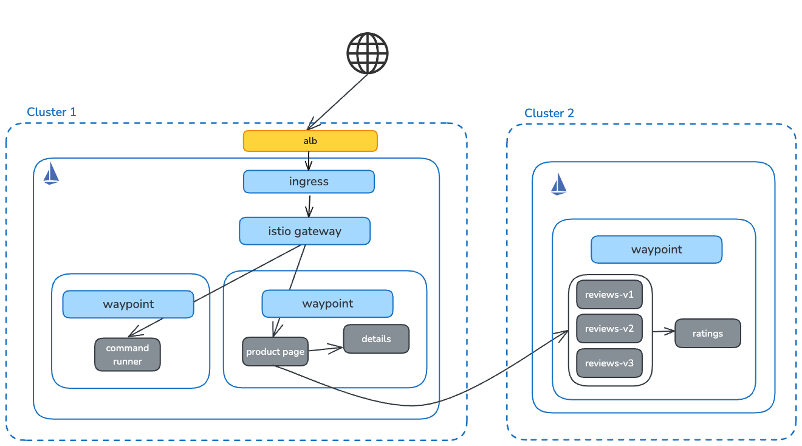

# Gloo Mesh Multi-cluster



# Introduction

This walkthrough demonstrates a multi-cluster setup in Gloo Mesh. It goes through the following:

1. Installing Gloo Mesh Management Server on the 1st cluster.
2. Installing the Gloo Operator and Service Mesh Controller on both clusters.
3. Configuring applications to use Istio Ambient mode.
4. Configure multi-cluster services in Istio.
5. Configuring a Gateway and associated HTTP routes for applications
6. Configuring a Waypoint proxy for applications.
7. Demonstrating Ambient features such as:
    1. Routing to specific application versions.
    2. Dynamic routing based on information such as headers.
    3. Isolating namespaces through authorization policies.
    4. Resiliency and fault injection.

# Prerequisites

Make sure you have the following available:

1. 2 Kubernetes clusters
2. The `kubectl` CLI - [installation](https://kubernetes.io/docs/tasks/tools/#kubectl)
3. The `helm` CLI - [installation](https://helm.sh/docs/intro/install/)
4. The `meshctl` tool - [installation](https://docs.solo.io/gloo-mesh/latest/setup/prepare/cli/)

Add the Gloo Platform repository if necessary:

```bash
helm repo add gloo-platform https://storage.googleapis.com/gloo-platform/helm-charts
helm repo update
```

# Set Up Environment

Set environment variables:

```bash
export CLUSTER1=<cluster1-context>
export CLUSTER2=<cluster2-context>
export CLUSTER1_NAME=cluster1
export CLUSTER2_NAME=cluster2
export GLOO_VERSION=2.9.1
export ISTIO_VERSION=1.26.2
export GLOO_MESH_LICENSE_KEY=<gloo-mesh-license-key>
export ACM_CERTIFICATE_ARN=<arn-of-cert>
```

Verify they’re set properly:

```bash
echo "Cluster 1: $CLUSTER1"
echo "Cluster 1 Name: $CLUSTER1_NAME"
echo "Cluster 2: $CLUSTER2"
echo "Cluster 2 Name: $CLUSTER2_NAME"
echo "Gloo Version: $GLOO_VERSION"
echo "Istio Version: $ISTIO_VERSION"
```

# Deploy Sample Applications

## Bookinfo

Remove any existing book info deployments:

```bash
for context in $CLUSTER1 $CLUSTER2; do
  kubectl delete --context $context -n bookinfo -f https://raw.githubusercontent.com/istio/istio/release-1.24/samples/bookinfo/platform/kube/bookinfo.yaml
  kubectl delete --context $context -n bookinfo -f https://raw.githubusercontent.com/istio/istio/release-1.26/samples/bookinfo/platform/kube/bookinfo-versions.yaml
  kubectl delete namespace --context $context bookinfo
done
```

Create the bookinfo namespace in both clusters

```bash
kubectl --context $CLUSTER1 create namespace bookinfo-frontend
kubectl --context $CLUSTER2 create namespace bookinfo-backend
```

Install the product page and details in cluster 1:

```bash
kubectl apply --context $CLUSTER1 -n bookinfo-frontend -f https://raw.githubusercontent.com/istio/istio/release-1.26/samples/bookinfo/platform/kube/bookinfo.yaml -l service=productpage
kubectl apply --context $CLUSTER1 -n bookinfo-frontend -f https://raw.githubusercontent.com/istio/istio/release-1.26/samples/bookinfo/platform/kube/bookinfo.yaml -l account=productpage
kubectl apply --context $CLUSTER1 -n bookinfo-frontend -f https://raw.githubusercontent.com/istio/istio/release-1.26/samples/bookinfo/platform/kube/bookinfo.yaml -l app=productpage
kubectl apply --context $CLUSTER1 -n bookinfo-frontend -f https://raw.githubusercontent.com/istio/istio/release-1.26/samples/bookinfo/platform/kube/bookinfo.yaml -l service=details
kubectl apply --context $CLUSTER1 -n bookinfo-frontend -f https://raw.githubusercontent.com/istio/istio/release-1.26/samples/bookinfo/platform/kube/bookinfo.yaml -l account=details
kubectl apply --context $CLUSTER1 -n bookinfo-frontend -f https://raw.githubusercontent.com/istio/istio/release-1.26/samples/bookinfo/platform/kube/bookinfo.yaml -l app=details
```

Install ratings and reviews in cluster 2:

```bash
kubectl apply --context $CLUSTER2 -n bookinfo-backend -f https://raw.githubusercontent.com/istio/istio/release-1.26/samples/bookinfo/platform/kube/bookinfo.yaml -l service=ratings
kubectl apply --context $CLUSTER2 -n bookinfo-backend -f https://raw.githubusercontent.com/istio/istio/release-1.26/samples/bookinfo/platform/kube/bookinfo.yaml -l account=ratings
kubectl apply --context $CLUSTER2 -n bookinfo-backend -f https://raw.githubusercontent.com/istio/istio/release-1.26/samples/bookinfo/platform/kube/bookinfo.yaml -l app=ratings
kubectl apply --context $CLUSTER2 -n bookinfo-backend -f https://raw.githubusercontent.com/istio/istio/release-1.26/samples/bookinfo/platform/kube/bookinfo.yaml -l service=reviews
kubectl apply --context $CLUSTER2 -n bookinfo-backend -f https://raw.githubusercontent.com/istio/istio/release-1.26/samples/bookinfo/platform/kube/bookinfo.yaml -l account=reviews
kubectl apply --context $CLUSTER2 -n bookinfo-backend -f https://raw.githubusercontent.com/istio/istio/release-1.26/samples/bookinfo/platform/kube/bookinfo.yaml -l app=reviews
kubectl set env -n bookinfo-backend --context $CLUSTER2 deployments/reviews-v1 CLUSTER_NAME=$CLUSTER2
kubectl set env -n bookinfo-backend --context $CLUSTER2 deployments/reviews-v2 CLUSTER_NAME=$CLUSTER2
kubectl set env -n bookinfo-backend --context $CLUSTER2 deployments/reviews-v3 CLUSTER_NAME=$CLUSTER2
```

Install the services for ratings in cluster 2:

```bash
kubectl apply --context $CLUSTER2 -n bookinfo-backend -f- <<EOF
apiVersion: v1
kind: Service
metadata:
  name: reviews-v1
spec:
  ports:
  - port: 9080
    name: http
  selector:
    app: reviews
    version: v1
---
apiVersion: v1
kind: Service
metadata:
  name: reviews-v2
spec:
  ports:
  - port: 9080
    name: http
  selector:
    app: reviews
    version: v2
---
apiVersion: v1
kind: Service
metadata:
  name: reviews-v3
spec:
  ports:
  - port: 9080
    name: http
  selector:
    app: reviews
    version: v3
EOF
```

Set the hostname for ratings and reviews in productpage:

```bash
kubectl set env -n bookinfo-frontend --context $CLUSTER1 deployments/productpage-v1 REVIEWS_HOSTNAME=reviews.bookinfo-backend.mesh.internal
kubectl set env -n bookinfo-frontend --context $CLUSTER1 deployments/productpage-v1 RATINGS_HOSTNAME=ratings.bookinfo-backend.mesh.internal
```

## Command Runner

Install the command runner application in cluster 1:

```bash
kubectl create namespace command-runner --context $CLUSTER1
kubectl apply --context $CLUSTER1 -n command-runner -f https://raw.githubusercontent.com/btjimerson/command-runner/refs/heads/main/manifests/command-runner.yaml
```

# Install Gloo Management Plane

Install the management plane in cluster 1:

```bash
helm upgrade --install gloo-platform-crds gloo-platform/gloo-platform-crds \
  -n gloo-mesh \
  --kube-context $CLUSTER1 \
  --create-namespace \
  --version=$GLOO_VERSION
  
helm upgrade --install gloo-platform gloo-platform/gloo-platform \
  -n gloo-mesh \
  --kube-context $CLUSTER1 \
  --version=$GLOO_VERSION \
  --set licensing.glooMeshLicenseKey=$GLOO_MESH_LICENSE_KEY \
  -f- <<EOF
common:
  cluster: cluster1
glooAgent:
  enabled: true
  runAsSidecar: true
  relay:
    serverAddress: gloo-mesh-mgmt-server.gloo-mesh:9900
glooAnalyzer:
  enabled: true
glooMgmtServer:
  enabled: true
  registerCluster: true
  policyApis:
    enabled: true
  serviceOverrides:
    metadata:
      annotations:
        service.beta.kubernetes.io/aws-load-balancer-type: external
        service.beta.kubernetes.io/aws-load-balancer-scheme: internet-facing
        service.beta.kubernetes.io/aws-load-balancer-nlb-target-type: instance
        service.beta.kubernetes.io/aws-load-balancer-ip-address-type: ipv4
glooInsightsEngine:
  enabled: true
glooUi:
  enabled: true
prometheus:
  enabled: true
redis:
  deployment:
    enabled: true
telemetryCollector:
  enabled: true
  mode: deployment
  replicaCount: 1
telemetryGateway:
  enabled: true
  service:
    annotations:
      service.beta.kubernetes.io/aws-load-balancer-type: external
      service.beta.kubernetes.io/aws-load-balancer-scheme: internet-facing
      service.beta.kubernetes.io/aws-load-balancer-nlb-target-type: instance
      service.beta.kubernetes.io/aws-load-balancer-ip-address-type: ipv4
installEnterpriseCrds: false
featureGates:
  ConfigDistribution: true
EOF

```

Wait for the management server to become available:

```bash
kubectl rollout status --context $CLUSTER1 -n gloo-mesh deployments/gloo-mesh-mgmt-server
```

Get the management server’s telemetry gateway address:

```bash
export TELEMETRY_GATEWAY_ADDRESS=$(kubectl get svc -n gloo-mesh gloo-telemetry-gateway --context $CLUSTER1 -o jsonpath="{.status.loadBalancer.ingress[0]['hostname','ip']}"):4317
echo "Telemetry gateway address = $TELEMETRY_GATEWAY_ADDRESS"

export MANAGEMENT_SERVER_ADDRESS=$(kubectl get svc -n gloo-mesh gloo-mesh-mgmt-server --context $CLUSTER1 -o jsonpath="{.status.loadBalancer.ingress[0]['hostname','ip']}"):9900
echo "Management server address = $MANAGEMENT_SERVER_ADDRESS"
```

Create a Kubernetes Cluster resource for cluster 2 in the management server:

```bash
kubectl apply --context $CLUSTER1 -f- <<EOF
apiVersion: admin.gloo.solo.io/v2
kind: KubernetesCluster
metadata:
   name: $CLUSTER2_NAME
   namespace: gloo-mesh
spec:
   clusterDomain: cluster.local
EOF
```

Install the Gloo mesh agent in cluster 2:

```bash
kubectl create namespace --context $CLUSTER2 gloo-mesh

kubectl get secret relay-root-tls-secret -n gloo-mesh --context $CLUSTER1 -o jsonpath='{.data.ca\.crt}' | base64 -d > ca.crt
kubectl create secret generic relay-root-tls-secret -n gloo-mesh --context $CLUSTER2 --from-file ca.crt=ca.crt
rm ca.crt

kubectl get secret relay-identity-token-secret -n gloo-mesh --context $CLUSTER1 -o jsonpath='{.data.token}' | base64 -d > token
kubectl create secret generic relay-identity-token-secret -n gloo-mesh --context $CLUSTER2 --from-file token=token
rm token

helm upgrade --install gloo-platform-crds gloo-platform/gloo-platform-crds \
 --namespace=gloo-mesh \
 --create-namespace \
 --version=$GLOO_VERSION \
 --set installEnterpriseCrds=false \
 --kube-context $CLUSTER2

helm upgrade --install gloo-platform gloo-platform/gloo-platform \
  --kube-context $CLUSTER2 \
  -n gloo-mesh \
  --version $GLOO_VERSION \
  -f- <<EOF
common:
  cluster: $CLUSTER2_NAME
glooAgent:
  enabled: true
  authority: gloo-meshmgmt-server.gloo-mesh
  relay:
    serverAddress: $MANAGEMENT_SERVER_ADDRESS
glooAnalyzer:
  enabled: true
installEnterpriseCrds: false
telemetryCollector:
  enabled: true
  config:
    exporters:
      otlp:
        endpoint: $TELEMETRY_GATEWAY_ADDRESS
telemetryCollectorCustomization:
  skipVerify: true
EOF
```

Wait for the agent to start properly:

```bash
kubectl rollout status --context $CLUSTER2 -n gloo-mesh deployments/gloo-mesh-agent
```

Ensure that cluster 2 is registered properly:

```bash
meshctl check --kubecontext $CLUSTER1
```

# Install Istio

## Kubernetes Gateway API

Install the Kubernetes Gateway CRDs:

```bash
for context in $CLUSTER1 $CLUSTER2; do
  kubectl apply --context $context -f https://github.com/kubernetes-sigs/gateway-api/releases/download/v1.2.1/standard-install.yaml
done
```

## Installation

Create a root trust policy:

```bash
kubectl --context=$CLUSTER1 apply -f- <<EOF
apiVersion: admin.gloo.solo.io/v2
kind: RootTrustPolicy
metadata:
  name: root-trust-policy
  namespace: gloo-mesh
spec:
  config:
    mgmtServerCa:
      generated: {} # self-signed ca
    autoRestartPods: true
EOF
```

Install the Gloo Istio operator:

```bash
for context in $CLUSTER1 $CLUSTER2; do
  helm upgrade --install --kube-context $context gloo-operator \
  oci://us-docker.pkg.dev/solo-public/gloo-operator-helm/gloo-operator \
  --version 0.2.5 \
  -n gloo-system \
  --create-namespace \
  --set manager.env.SOLO_ISTIO_LICENSE_KEY=$GLOO_MESH_LICENSE_KEY
done
```

Wait for the operator to become available:

```bash
for context in $CLUSTER1 $CLUSTER2; do
  kubectl rollout status --context $context -n gloo-system deployments/gloo-operator
done
```
Create the istio-system namespace:

```bash
for context in $CLUSTER1 $CLUSTER2; do
  kubectl create namespace istio-system
done
```

Create service mesh controllers to install Istio on both clusters

```bash
kubectl --context $CLUSTER1 apply -f- <<EOF
apiVersion: operator.gloo.solo.io/v1
kind: ServiceMeshController
metadata:
  name: istio
spec:
  version: $ISTIO_VERSION
  cluster: $CLUSTER1_NAME
  network: $CLUSTER1_NAME
EOF

kubectl --context $CLUSTER2 apply -f- <<EOF
apiVersion: operator.gloo.solo.io/v1
kind: ServiceMeshController
metadata:
  name: istio
spec:
  version: $ISTIO_VERSION
  cluster: $CLUSTER2_NAME
  network: $CLUSTER2_NAME
EOF
```

Wait for the istio control planes to become available:

```bash
for context in $CLUSTER1 $CLUSTER2; do
  kubectl rollout status --context $context -n istio-system deployments/istiod-gloo
done
```

Join workloads to the mesh:

```bash
kubectl --context $CLUSTER1 label namespace bookinfo-frontend istio.io/dataplane-mode=ambient --overwrite
kubectl --context $CLUSTER2 label namespace bookinfo-backend istio.io/dataplane-mode=ambient --overwrite

kubectl --context $CLUSTER1 label namespace command-runner istio.io/dataplane-mode=ambient --overwrite
```

## Multi-cluster Services

Deploy east-west gateways in both clusters:
    
```bash
for context in $CLUSTER1 $CLUSTER2; do
  kubectl create namespace --context $context istio-gateways
done

kubectl apply --context $CLUSTER1 -f- <<EOF
apiVersion: gateway.networking.k8s.io/v1
kind: Gateway
metadata:
  labels:
    istio.io/expose-istiod: "15012"
    topology.istio.io/network: $CLUSTER1_NAME
  annotations:
    service.beta.kubernetes.io/aws-load-balancer-type: external
    service.beta.kubernetes.io/aws-load-balancer-scheme: internet-facing
    service.beta.kubernetes.io/aws-load-balancer-nlb-target-type: instance
    service.beta.kubernetes.io/aws-load-balancer-ip-address-type: ipv4
  name: istio-eastwest
  namespace: istio-gateways
spec:
  gatewayClassName: istio-eastwest
  listeners:
  - name: cross-network
    port: 15008
    protocol: HBONE
    tls:
      mode: Passthrough
  - name: xds-tls
    port: 15012
    protocol: TLS
    tls:
      mode: Passthrough
EOF

kubectl apply --context $CLUSTER2 -f- <<EOF
apiVersion: gateway.networking.k8s.io/v1
kind: Gateway
metadata:
  labels:
    istio.io/expose-istiod: "15012"
    topology.istio.io/network: $CLUSTER2_NAME
  annotations:
    service.beta.kubernetes.io/aws-load-balancer-type: external
    service.beta.kubernetes.io/aws-load-balancer-scheme: internet-facing
    service.beta.kubernetes.io/aws-load-balancer-nlb-target-type: instance
    service.beta.kubernetes.io/aws-load-balancer-ip-address-type: ipv4
  name: istio-eastwest
  namespace: istio-gateways
spec:
  gatewayClassName: istio-eastwest
  listeners:
  - name: cross-network
    port: 15008
    protocol: HBONE
    tls:
      mode: Passthrough
  - name: xds-tls
    port: 15012
    protocol: TLS
    tls:
      mode: Passthrough
EOF
```
    

Wait for the east-west gateways to become available:

```bash
for context in $CLUSTER1 $CLUSTER2; do
  kubectl wait gateway/istio-eastwest --for=condition=Programmed --context $context -n istio-gateways
done
```

Get the addresses of the 2 clusters’ east-west gateways and link them with Gateways
    
```bash
export CLUSTER1_EW_ADDRESS=$(kubectl get svc -n istio-gateways istio-eastwest --context $CLUSTER1 -o jsonpath="{.status.loadBalancer.ingress[0]['hostname','ip']}")
export CLUSTER2_EW_ADDRESS=$(kubectl get svc -n istio-gateways istio-eastwest --context $CLUSTER2 -o jsonpath="{.status.loadBalancer.ingress[0]['hostname','ip']}")

echo "Cluster 1 east-west gateway: $CLUSTER1_EW_ADDRESS"
echo "Cluster 2 east-west gateway: $CLUSTER2_EW_ADDRESS"

kubectl apply --context $CLUSTER1 -f- <<EOF
apiVersion: gateway.networking.k8s.io/v1
kind: Gateway
metadata:
  annotations:
    gateway.istio.io/service-account: istio-eastwest
    gateway.istio.io/trust-domain: $CLUSTER2_NAME
  labels:
    topology.istio.io/network: $CLUSTER2_NAME
  name: istio-remote-peer-$CLUSTER2_NAME
  namespace: istio-gateways
spec:
  addresses:
  - type: Hostname # Change this to IPAddress on gcloud and azure
    value: $CLUSTER2_EW_ADDRESS
  gatewayClassName: istio-remote
  listeners:
  - name: cross-network
    port: 15008
    protocol: HBONE
    tls:
      mode: Passthrough
  - name: xds-tls
    port: 15012
    protocol: TLS
    tls:
      mode: Passthrough
EOF

kubectl apply --context $CLUSTER2 -f- <<EOF
apiVersion: gateway.networking.k8s.io/v1
kind: Gateway
metadata:
  annotations:
    gateway.istio.io/service-account: istio-eastwest
    gateway.istio.io/trust-domain: $CLUSTER1_NAME
  labels:
    topology.istio.io/network: $CLUSTER1_NAME
  name: istio-remote-peer-$CLUSTER1_NAME
  namespace: istio-gateways
spec:
  addresses:
  - type: Hostname # Change this to IPAddress on gcloud and azure
    value: $CLUSTER1_EW_ADDRESS
  gatewayClassName: istio-remote
  listeners:
  - name: cross-network
    port: 15008
    protocol: HBONE
    tls:
      mode: Passthrough
  - name: xds-tls
    port: 15012
    protocol: TLS
    tls:
      mode: Passthrough
EOF
```

Label the ratings and reviews to enable multi-cluster routing:

```bash
kubectl label service --context $CLUSTER2 -n bookinfo-backend ratings solo.io/service-scope=global --overwrite
kubectl label service --context $CLUSTER2 -n bookinfo-backend reviews solo.io/service-scope=global --overwrite
```

## Gateway Configuration

Create a secret for TLS termination:

```bash
kubectl create --context $CLUSTER1 -n istio-gateways secret generic tls-secret --from-file=key=certs/key.pem --from-file=cert=certs/cert.pem
```

Create a gateway for cluster 1:

```bash
kubectl --context=$CLUSTER1 apply -f- <<EOF
apiVersion: gateway.networking.k8s.io/v1
kind: Gateway
metadata:
  name: http-gateway
  namespace: istio-gateways
  annotations:
    networking.istio.io/service-type: NodePort
spec:
  gatewayClassName: istio
  listeners:
  - name: http
    port: 80
    protocol: HTTP
    allowedRoutes:
      namespaces:
        from: All
EOF
```

Create an ALB ingress object for cluster 1:

```bash
kubectl apply -f- <<EOF
apiVersion: networking.k8s.io/v1
kind: Ingress
metadata:
  namespace: istio-gateways
  name: alb
  annotations:
    alb.ingress.kubernetes.io/scheme: internet-facing
    alb.ingress.kubernetes.io/target-type: instance
    alb.ingress.kubernetes.io/healthcheck-protocol: HTTP
    alb.ingress.kubernetes.io/healthcheck-port: "30285"
    alb.ingress.kubernetes.io/healthcheck-path: "/healthz/ready"
    alb.ingress.kubernetes.io/listen-ports: '[{"HTTPS": 443}]'
    alb.ingress.kubernetes.io/certificate-arn: $ACM_CERTIFICATE_ARN
spec:
  ingressClassName: alb
  tls:
  - secretName: tls-secret
  rules:
    - http:
        paths:
        - path: /
          pathType: Prefix
          backend:
            service:
              name: http-gateway-istio
              port:
                number: 80
EOF
```

Get the address of the gateway:

```bash
export GATEWAY_ADDRESS=$(kubectl get ingress -n istio-gateways alb --context $CLUSTER1 -o jsonpath="{.status.loadBalancer.ingress[0]['hostname','ip']}")
echo "Gateway address: $GATEWAY_ADDRESS"
```

## HTTP Route Configuration

Create a route for the global product page destination:

```bash
kubectl --context $CLUSTER1 apply -f - <<EOF
apiVersion: gateway.networking.k8s.io/v1
kind: HTTPRoute
metadata:
  name: bookinfo-route
  namespace: bookinfo-frontend
spec:
  parentRefs:
  - name: http-gateway
    namespace: istio-gateways
  rules:
  - matches:
    - path:
        type: PathPrefix
        value: /
    backendRefs:
    - name: productpage
      port: 9080
EOF
```

Open the product page. Verify that traffic is routed to cluster 2 for ratings and reviews

```bash
open $(echo https://$GATEWAY_ADDRESS/productpage)
```

## Waypoint Configuration

Deploy a waypoint to the `bookinfo-frontend` namespace for layer 7 controls:

```bash
kubectl apply --context $CLUSTER1 -f- <<EOF
apiVersion: gateway.networking.k8s.io/v1
kind: Gateway
metadata:
  name: waypoint
  namespace: bookinfo-frontend
spec:
  gatewayClassName: istio-waypoint
  listeners:
  - name: mesh
    port: 15008
    protocol: HBONE
EOF

kubectl label namespace bookinfo-frontend --context $CLUSTER1 istio.io/use-waypoint=waypoint
```

Deploy a waypoint to the `bookinfo-backend` namespace for layer 7 controls:

```bash
kubectl apply --context $CLUSTER2 -f- <<EOF
apiVersion: gateway.networking.k8s.io/v1
kind: Gateway
metadata:
  name: waypoint
  namespace: bookinfo-backend
spec:
  gatewayClassName: istio-waypoint
  listeners:
  - name: mesh
    port: 15008
    protocol: HBONE
EOF

kubectl label namespace bookinfo-backend --context $CLUSTER2 istio.io/use-waypoint=waypoint
```

Create a destination rule for the subsets of the reviews service

```bash
kubectl apply --context $CLUSTER2 -f- <<EOF
apiVersion: networking.istio.io/v1beta1
kind: DestinationRule
metadata:
  name: reviews-dr
  namespace: bookinfo-backend
spec:
  host: reviews
  subsets:
  - name: v1
    labels:
      version: v1
  - name: v2
    labels:
      version: v2
  - name: v3
    labels:
      version: v3
EOF
```

# Ambient Features

## Route to Specific Version

Route all traffic to reviews v1:

```bash
kubectl apply --context $CLUSTER2 -f- <<EOF
apiVersion: gateway.networking.k8s.io/v1beta1
kind: HTTPRoute
metadata:
  name: global-reviews
  namespace: bookinfo-backend
spec:
  parentRefs:
  - group: gateway.networking.k8s.io
    kind: Gateway
    name: istio-eastwest
    namespace: istio-gateways
  hostnames:
  - "reviews.bookinfo-backend.mesh.internal"
  rules:
  - backendRefs:
    - name: reviews.bookinfo-backend.mesh.internal
      port: 9080
---
apiVersion: networking.istio.io/v1beta1
kind: VirtualService
metadata:
  name: reviews-vs
  namespace: bookinfo-backend
spec:
  hosts:
  - "reviews.bookinfo-backend.mesh.internal"
  http:
  - route:
    - destination:
        host: reviews.bookinfo-backend.svc.cluster.local
        subset: v1
        port:
          number: 9080
EOF
```

Show that all traffic is served by v1 of reviews:

```bash
open $(echo http://$GATEWAY_ADDRESS/productpage)
```

Clean up the route:

```bash
kubectl delete httproute --context $CLUSTER2 -n bookinfo-backend global-reviews
kubectl delete virtualservice --context $CLUSTER2 -n bookinfo-backend reviews-vs
```

## Namespace Isolation

Enforce strict mTLS with a peer authentication policy:

```bash
for context in $CLUSTER1 $CLUSTER2; do
kubectl apply --context $context -f- <<EOF
apiVersion: security.istio.io/v1
kind: PeerAuthentication
metadata:
  name: default
  namespace: istio-system
spec:
  mtls:
    mode: STRICT
EOF
done
```

Apply an authorization policy that isolates traffic to the bookinfo-backend namespace:

```bash
kubectl apply --context $CLUSTER2 -f- <<EOF
apiVersion: security.istio.io/v1beta1
kind: AuthorizationPolicy
metadata:
  name: namespace-isolation
  namespace: bookinfo-backend
spec:
  action: ALLOW
  rules:
  - from:
    - source:
        namespaces: ["bookinfo-backend"]
  targetRefs:
  - kind: Gateway
    group: gateway.networking.k8s.io
    name: waypoint
EOF
```

Open the command runner application and try to curl the reviews API:

```bash
curl -ivk http://reviews.bookinfo-backend.mesh.internal:9080/reviews/1 
```

Remove the authorization policy:

```bash
kubectl delete authorizationpolicy namespace-isolation --context $CLUSTER2 -n bookinfo-backend
```

Try to curl the reviews API again:

```bash
curl -ik http://reviews.bookinfo-backend.mesh.internal:9080/reviews/1 
```

## Request Timeouts

Route traffic to v2 of reviews (which calls the ratings service):

```bash
kubectl apply --context $CLUSTER2 -f- <<EOF
apiVersion: gateway.networking.k8s.io/v1beta1
kind: HTTPRoute
metadata:
  name: global-reviews
  namespace: bookinfo-backend
spec:
  parentRefs:
  - group: gateway.networking.k8s.io
    kind: Gateway
    name: istio-eastwest
    namespace: istio-gateways
  hostnames:
  - "reviews.bookinfo-backend.mesh.internal"
  rules:
  - backendRefs:
    - name: reviews.bookinfo-backend.mesh.internal
      port: 9080
---
apiVersion: networking.istio.io/v1beta1
kind: VirtualService
metadata:
  name: reviews-vs
  namespace: bookinfo-backend
spec:
  hosts:
  - "reviews.bookinfo-backend.mesh.internal"
  http:
  - route:
    - destination:
        host: reviews.bookinfo-backend.svc.cluster.local
        subset: v2
        port:
          number: 9080
EOF
```

Add a 2 second delay to the ratings service:

```bash
kubectl apply --context $CLUSTER2 -f- <<EOF
apiVersion: networking.istio.io/v1
kind: VirtualService
metadata:
  name: ratings-vs
  namespace: bookinfo-backend
spec:
  hosts:
  - ratings
  http:
  - fault:
      delay:
        fixedDelay: 2s
        percentage:
          value: 100.0
    route:
    - destination:
        host: ratings
EOF
```

Open the product page and notice the 2 second delay:

```bash
open $(echo http://$GATEWAY_ADDRESS/productpage)
```

Update the reviews route to use a 0.5 second timeout:

```bash
kubectl apply --context $CLUSTER2 -f- <<EOF
apiVersion: gateway.networking.k8s.io/v1beta1
kind: HTTPRoute
metadata:
  name: global-reviews
  namespace: bookinfo-backend
spec:
  parentRefs:
  - group: gateway.networking.k8s.io
    kind: Gateway
    name: istio-eastwest
    namespace: istio-gateways
  hostnames:
  - "reviews.bookinfo-backend.mesh.internal"
  rules:
  - backendRefs:
    - name: reviews.bookinfo-backend.mesh.internal
      port: 9080
    timeouts:
      request: 500ms
EOF
```

Open the product page again. The reviews should be unavailable because the timeout is less than the delay:

```bash
open $(echo http://$GATEWAY_ADDRESS/productpage)
```

Clean up the virtual services and routes:

```bash
kubectl delete httproute global-reviews --context $CLUSTER2 -n bookinfo-backend
kubectl delete virtualservice reviews-vs --context $CLUSTER2 -n bookinfo-backend
kubectl delete virtualservice ratings-vs --context $CLUSTER2 -n bookinfo-backend
```

# Observability

Launch the dashboard:

```bash
meshctl dashboard --kubecontext=$CLUSTER1
```


# Clean up

Clean up all resources:

```bash
# all waypoints
kubectl delete gateway waypoint --context $CLUSTER1 -n bookinfo-frontend
kubectl delete gateway waypoint --context $CLUSTER2 -n bookinfo-backend
kubectl delete gateway waypoint --context $CLUSTER1 -n command-runner

# application routes and gateway
kubectl delete httproute bookinfo-route --context $CLUSTER1 -n bookinfo-frontend
kubectl delete httproute command-runner-route --context $CLUSTER1 -n command-runner
kubectl delete gateway http-gateway --context $CLUSTER1 -n istio-gateways
kubectl delete ingress alb --context $CLUSTER1 -n istio-gateways

# istio gateways
kubectl delete gateway istio-remote-peer-cluster1 --context $CLUSTER2 -n istio-gateways
kubectl delete gateway istio-remote-peer-cluster2 --context $CLUSTER1 -n istio-gateways
kubectl --context $CLUSTER2 -n bookinfo-backend label ratings productpage solo.io/service-scope-
kubectl --context $CLUSTER2 -n bookinfo-backend label reviews productpage solo.io/service-scope-
for context in $CLUSTER1 $CLUSTER2; do
  kubectl delete service istio-eastwest --context $context -n istio-gateways
  kubectl delete gateway istio-eastwest --context $context -n istio-gateways
  kubectl delete namespace istio-gateways --context $context
done

# istio
for context in $CLUSTER1 $CLUSTER2; do
  kubectl delete peerauthentication default --context $context -n istio-system
  kubectl delete servicemeshcontroller istio --context $context
  helm uninstall gloo-operator --kube-context $context -n gloo-system
  kubectl delete namespace gloo-system --context $context
  kubectl get crds --context $context -oname | grep --color=never 'istio.io' | xargs kubectl delete --context $context --ignore-not-found
done
kubectl delete roottrustpolicy root-trust-policy --context $CLUSTER1 -n gloo-mesh

# gloo management plane
helm uninstall gloo-platform --kube-context $CLUSTER2 -n gloo-mesh
helm uninstall gloo-platform-crds --kube-context $CLUSTER2 -n gloo-mesh
kubectl delete secret relay-root-tls-secret --context $CLUSTER2 -n gloo-mesh
kubectl delete secret relay-identity-token-secret --context $CLUSTER2 -n gloo-mesh
kubectl delete kubernetescluster $CLUSTER2_NAME --context $CLUSTER1 -n gloo-mesh
helm uninstall gloo-platform --kube-context $CLUSTER1 -n gloo-mesh
helm uninstall gloo-platform-crds --kube-context $CLUSTER1 -n gloo-mesh
kubectl delete secret relay-client-tls-secret --context $CLUSTER1 -n gloo-mesh
kubectl delete namespace gloo-mesh --context $CLUSTER1
for context in $CLUSTER1 $CLUSTER2; do
    kubectl get crds --context $context -oname | grep --color=never 'solo.io' | xargs kubectl delete --context $context --ignore-not-found
done

# sample apps
kubectl delete --context $CLUSTER1 -f https://raw.githubusercontent.com/btjimerson/command-runner/refs/heads/main/kubernetes/command-runner.yaml
for context in $CLUSTER1 $CLUSTER2; do
  kubectl --context $context delete -n bookinfo -f https://raw.githubusercontent.com/istio/istio/release-1.24/samples/bookinfo/platform/kube/bookinfo.yaml
  kubectl --context $context delete -n bookinfo -f https://raw.githubusercontent.com/istio/istio/release-1.24/samples/bookinfo/platform/kube/bookinfo-versions.yaml
done
kubectl --context $CLUSTER1 delete namespace bookinfo-frontend
kubectl --context $CLUSTER2 delete namespace bookinfo-backend

# gatewapi crds
for context in $CLUSTER1 $CLUSTER2; do
  kubectl delete --context $context -f https://github.com/kubernetes-sigs/gateway-api/releases/download/v1.2.1/standard-install.yaml
done
```
